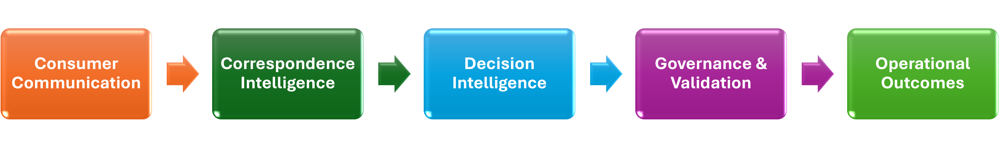

# Decision Standardization Framework

Customer-facing operations often depend on human interpretation when reviewing consumer communications. Different reviewers may reach different conclusions from the same correspondence, creating inconsistency, audit challenges, compliance risk, and variation in customer outcomes.

This framework was developed to standardize decision-making across unstructured communication channels by converting subjective interpretation into explicit decision logic, governance controls, and validation mechanisms.

Developed through analysis of 89,000+ consumer correspondences and validated using 20,000 audited samples, the framework provides a structured approach for creating consistent, auditable, and repeatable operational decisions in restricted environments.

## At a Glance

| Metric | Value |
|----------|----------|
| Communications Analyzed | 89,000+ |
| Audited Samples | 20,000 |
| Communication Channels | Letters, Emails, SMS |
| Decision Categories | 45 |
| Validation Confidence | 95%-99% |
| Primary Objective | Decision Consistency |

---
## Framework Layers

### 1. Decision Standardization

Defines the rules, criteria, and governance required to ensure that similar communications receive consistent outcomes regardless of reviewer interpretation.

### 2. Signal Interpretation

Transforms unstructured consumer communications into structured signals through category mapping, keyword identification, and communication analysis.

### 3. Decision Logic

Applies decision hierarchies, precedence rules, and conflict resolution logic to convert detected signals into consistent business outcomes.

### 4. Governance & Validation

Measures reliability, consistency, and auditability through sampling, confidence testing, variance analysis, and ongoing refinement.
### 5. Operational Outcomes

Supports routing, escalation, compliance activities, reporting, and future automation initiatives.

---
## The Challenge

Consumer communications arrive in many forms, including formal letters, detailed emails, and short SMS messages. Although customers may be expressing the same underlying concern, differences in language, context, and communication style can lead to different interpretations.

As a result, operational decisions may become dependent on individual reviewer judgement rather than standardized criteria, creating:

- Interpretation variability
- Inconsistent customer outcomes
- Quality assurance challenges
- Increased audit effort
- Compliance and governance risks

The core challenge was not processing communications.

The core challenge was ensuring that the same decision would be reached regardless of who reviewed the communication.

---

## Framework Overview

Unstructured Communications

↓

Signal Interpretation

↓

Decision Intelligence

↓

Governance & Validation

↓

Operational Outcomes

↓

Consistent Business Decisions

---

## Phase 1 – Signal Interpretation

Phase 1 established the framework's ability to identify and structure decision-relevant signals from unstructured communications.

Capabilities included:

- Signal Detection
- Category Mapping
- Decision Rule Support
- Outcome Determination
- Signal Optimization
- Statistical Validation

📖 Explore the Framework

[Framework Architecture](../framework-architecture.md)

[Signal Interpretation Layer](../Signal-Interpretation-Layer.md)

[Decision Engine](../Decision_Engine.md)

[Validation and Governance](../Validation-and-Governance.md)

[Governance Principles](../governance.md)

[Signal Optimization](../Signal-Optimization.md)

[Case Study Correspondence Classification](../Case-Study-Correspondence-Classification.md)

---

## Key Design Principles

- Explainability
- Auditability
- Consistency
- Governance

---

## Framework Principle

Operational automation is only effective when decision-making is consistent.

Customer communications often contain varying levels of detail, context, and language. Before automation can be introduced, the underlying decision process must first be standardized, validated, and governed.

This framework was built on a simple principle:

Messy Inputs
↓
Structured Signals
↓
Standardized Decision Logic
↓
Consistent Outcomes
↓
Automation Readiness

---

## Future Evolution

Phase 2 – Intent Detection

Expanding beyond keyword detection to evaluate context, negations, modifiers, and semantic intent.

---
## About This Framework

This framework was developed to address a common operational challenge: ensuring consistent business decisions from unstructured customer communications.

The objective was not to automate correspondence review, but to first standardize the decision-making process through explicit rules, governance controls, validation methods, and outcome hierarchies.

The resulting framework demonstrates how predictable decisions can be established in restricted environments before introducing large-scale automation initiatives.

---
## Author

**Rishi Bharaj**

PMP® | Oracle GenAI Professional | ISO 9001 Lead Auditor

Experienced in operational transformation, quality governance, decision standardization, and process improvement initiatives focused on creating scalable, auditable, and consistent business outcomes.
