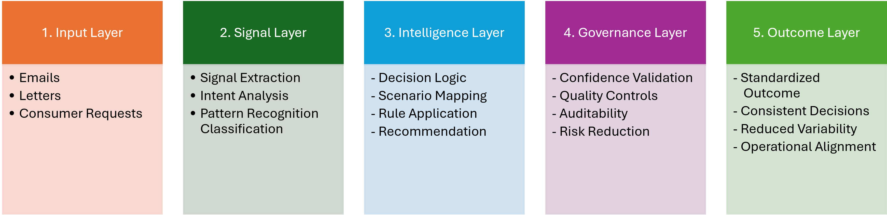

# Decision Standardization Framework
## The Problem
Customer communications are often reviewed and interpreted by individual employees. When similar communications are interpreted differently, organizations may experience:
- Inconsistent customer outcomes
- Increased audit effort
- Quality assurance challenges
- Compliance risk
- Reduced automation potential

The challenge is not processing communications.

The challenge is ensuring that the same decision is reached regardless of who reviews the communication.

## The Idea
Standardize decisions before attempting automation.
The framework transforms unstructured customer communications into consistent and auditable business outcomes by converting subjective interpretation into explicit decision logic.



## Framework Summary

| Layer | Input | Processing | Output |
|---------|---------|---------|---------|
| Signal Interpretation | Customer Communications | Signal Detection, Categorization, Interpretation | Structured Signals |
| Decision Logic | Structured Signals | Rule Application, Prioritization, Scenario Mapping | Recommended Decision |
| Governance & Validation | Recommended Decision | Validation, Variance Analysis, Audit Controls | Governed Decision |
| Operational Outcomes | Governed Decision | Routing, Escalation, Reporting | Consistent Business Outcome |

## End-to-End Flow

```text
Customer Communication
→ Signal Interpretation
→ Decision Logic
→ Governance & Validation
→ Operational Outcome
→ Consistent Business Decision

## Example
### Customer Communication
> "Please do not contact me directly. My attorney is representing me regarding this matter."
### Signals Identified
- Attorney Representation
- Communication Restriction
### Decision Logic
Communication restrictions apply through legal representation channels rather than directly to the consumer.
### Outcome
Consistent handling regardless of reviewer interpretation.

## Scale
The framework was developed and validated using:
- 89,000+ customer communications
- 20,000 audited samples
- 45 standardized decision scenarios
- Multiple communication channels (Letters, Emails, SMS)
- Validation confidence levels ranging from 95% to 99%

## Why It Matters
A standardized decision framework can help organizations:
- Reduce interpretation variability
- Improve auditability
- Strengthen quality assurance controls
- Accelerate onboarding through consistent decision criteria
- Create a foundation for future automation

## Core Insight
Before automation becomes possible, decisions must become predictable.

## Explore the Framework

1. **[Framework Architecture](framework-architecture.md)** - Overview of the framework structure and decision flow.
2. **[Signal Interpretation](Signal-Interpretation-Layer.md)** - How decision-relevant signals are identified from unstructured communications.
3. **[Validation & Governance](Validation-and-Governance.md)** - How consistency, reliability, and repeatability are measured and maintained.
4. **[Case-Study](Case-Study.md)** - Application of the framework across large-scale customer communications.
5. **[Supporting Tools](supporting-tooling/README.md)** - Examples of tools used to support signal discovery, refinement, and framework maintenance.

## Author
**Rishi Bharaj**
PMP® | Oracle GenAI Professional | ISO 9001 Lead Auditor
Operations Transformation | Decision Standardization | Governance | Process Improvement

## Related Repositories

- 📄 Document Intelligence Pipeline
- 🔍 Search & Match Intelligence Framework
- 🧠 Knowledge Explorer
- 🤖 Reinforcement Learning Reward Shaping
