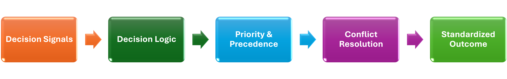

# Framework Architecture

The Decision Standardization Framework transforms unstructured communications into consistent and auditable business outcomes.

---

## Framework Layers

- **Signal Interpretation**  
  Identifies decision-relevant signals from unstructured communications.

- **Decision Logic**  
  Applies business rules and decision criteria to evaluate potential outcomes.

- **Precedence & Conflict Resolution**  
  Resolves competing signals and determines the most appropriate outcome.

- **Governance & Validation**  
  Measures consistency, reliability, and repeatability through audit and validation controls.

- **Consistent Business Outcomes**  
  Supports operational actions, compliance, reporting, and automation readiness.

---

## Core Insight

Classification is an enabling capability.

The primary objective is standardized decision-making.
